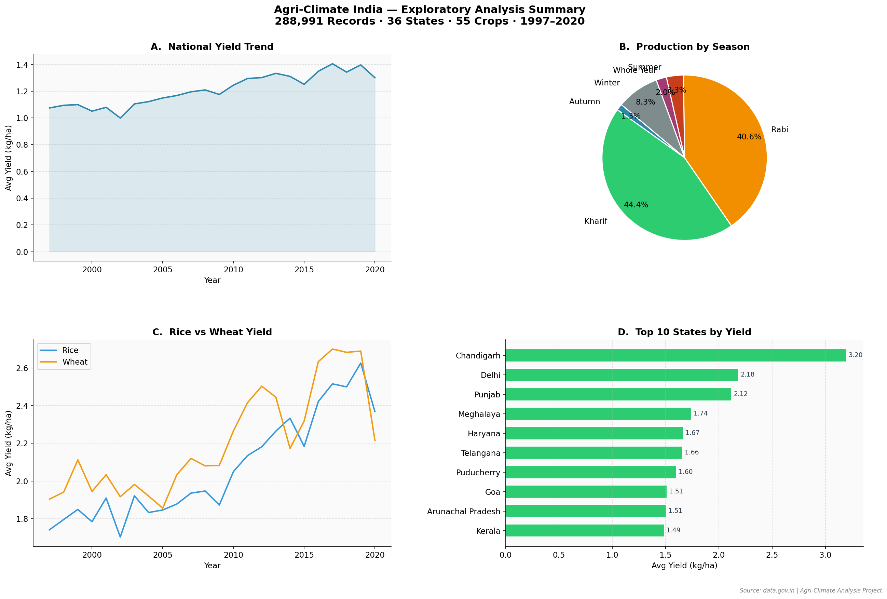
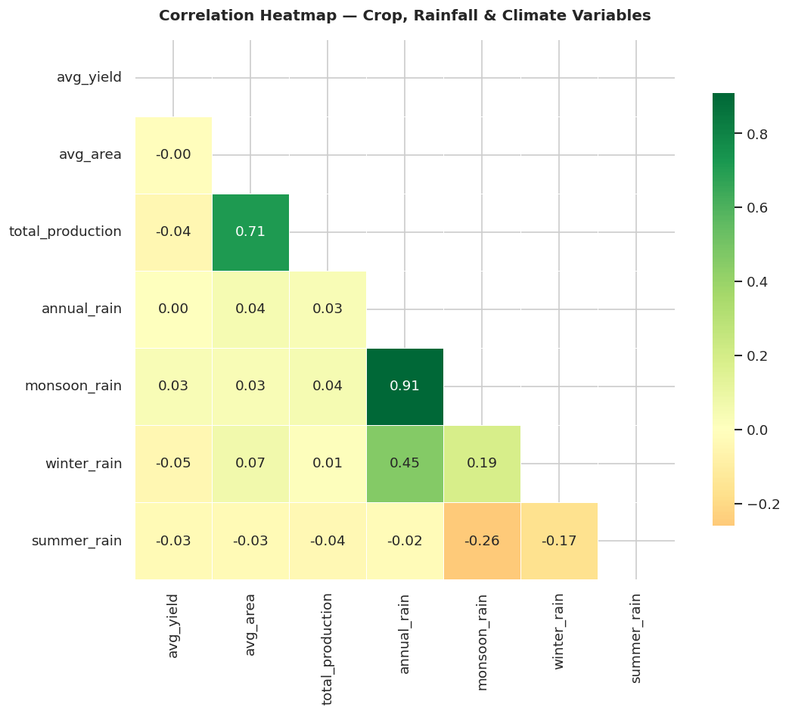
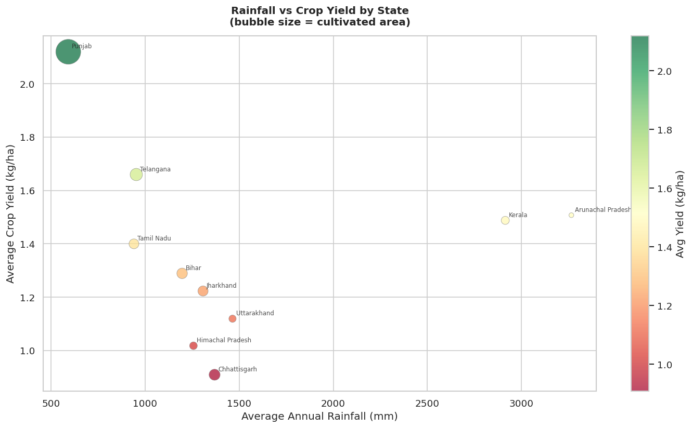
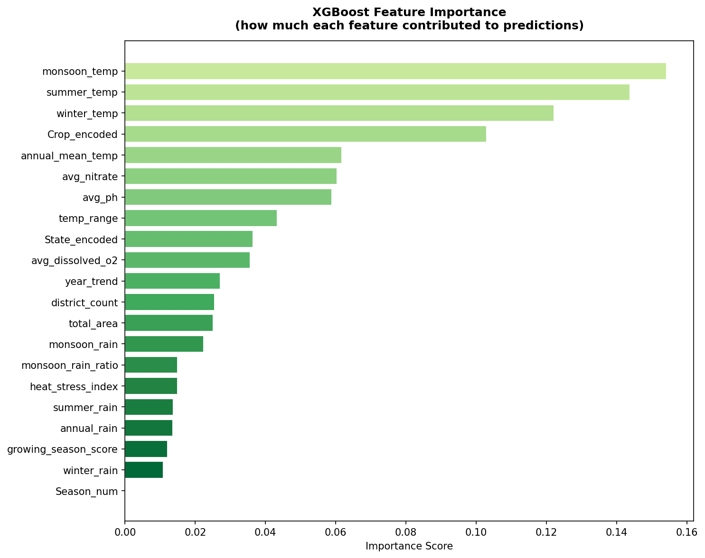

# 🌾 AgriClimate India
### Crop Yield & Climate Analysis Dashboard

[](https://lokendra-s-parihar-agri-climate.streamlit.app)
[](https://python.org)
[](https://xgboost.readthedocs.io)
[](LICENSE)

> An interactive data science dashboard analysing how climate variables — rainfall,
> temperature, and water quality — affect crop productivity across 36 Indian states
> from 1997 to 2020. Built with Python, Streamlit, Plotly, Folium, and XGBoost.

**🔗 Live App:** https://lokendra-s-parihar-agri-climate.streamlit.app

---

## 📸 Dashboard Preview

| Home Page | EDA Explorer |
|---|---|
|  |  |

| India Yield Map | Yield Predictor |
|---|---|
|  |  |

---

## 🎯 Project Motivation

India feeds over 1.4 billion people, yet crop productivity varies dramatically across
states and years. This project investigates **how climate variables drive those
differences** — and builds a machine learning model to predict crop yield from
rainfall and temperature inputs.

Key research questions:
- Which climate variables most strongly predict crop yield?
- How has Indian agricultural productivity trended from 1997–2020?
- What impact would climate change scenarios (rainfall deficit, temperature rise)
  have on crop productivity?

---

## 📊 Key Findings

| Finding | Detail |
|---|---|
| **Yield improved 30%** | National average yield rose from ~1.08 to ~1.40 kg/ha (1997–2020) |
| **Temperature > Rainfall** | Temperature variables explain 40%+ of model variance vs rainfall |
| **Punjab paradox** | Highest yield state despite lowest rainfall — canal irrigation effect |
| **Monsoon dominance** | JJAS monsoon = 91% of annual rainfall variation |
| **2002 drought** | Clearly visible as yield dip — worst Indian drought in 40 years |
| **Rabi + Kharif** | Together account for 85% of total crop production |

---

## 🏗️ Project Architecture

AgriClimate India
├── app.py                    # Home dashboard
├── pages/
│   ├── 1_EDA.py             # Interactive EDA explorer
│   ├── 2_Map.py             # India choropleth map
│   └── 3_Predictor.py       # XGBoost yield predictor
├── utils/
│   └── data_loader.py       # Cached data loading
├── Data/
│   ├── crop_clean.csv        # 288,991 crop records (cleaned)
│   ├── rain_clean.csv        # Rainfall data 1901–2017
│   ├── temp_clean.csv        # Temperature by state
│   ├── water_clean.csv       # Water quality indicators
│   ├── master_ml_dataset.csv # Merged ML-ready dataset
│   ├── xgboost_model.pkl     # Trained XGBoost model
│   └── label_encoders.pkl    # State + crop encoders
├── Notebooks/
│   ├── week3_cleaningdata.ipynb
│   ├── week4_EDA.ipynb
│   ├── week5_visualization.ipynb
│   ├── week7_ML_prep.ipynb
│   └── week8_XGBoost.ipynb
├── Outputs/                  # All generated charts + maps
└── requirements.txt


---

## 📁 Data Sources

| Dataset | Source | Records | Coverage |
|---|---|---|---|
| Crop Production | [data.gov.in](https://data.gov.in) | 345,336 raw → 288,991 clean | 36 states, 55 crops, 1997–2020 |
| Rainfall | [IMD via Kaggle](https://kaggle.com) | 4,188 rows | 36 subdivisions, 1901–2017 |
| Temperature | IMD | 33 rows | 33 states, long-term avg |
| Water Quality | CPCB India | 194 rows | 17 states, 2021–2023 |

---

## 🤖 Machine Learning Model

### Algorithm: XGBoost Regressor (v2 — regularised)

| Metric | Value |
|---|---|
| R² Score (test) | 0.7491 |
| RMSE | 0.4652 kg/ha |
| CV R² (5-fold) | 0.3045 ± 0.1123 |
| Training samples | 5,486 |
| Features | 21 |

### Top features by importance

| Rank | Feature | Importance |
|---|---|---|
| 1 | monsoon_temp | 0.1542 |
| 2 | summer_temp | 0.1439 |
| 3 | winter_temp | 0.1222 |

**Key insight:** Temperature variables dominate predictive power, suggesting
rising temperatures from climate change pose a greater threat to Indian
agricultural productivity than changing rainfall patterns alone.

### Feature engineering
- Monsoon rain ratio (monsoon/annual rainfall)
- Heat stress index (summer temp / rainfall intensity)
- Growing season score (monsoon rain × monsoon temp interaction)
- Year trend (captures technological improvement over time)

---

## 🗺️ Dashboard Features

### 🏠 Home Page
- 5 key metrics: records, states, crops, year range, national avg yield
- Interactive national yield trend (area chart)
- Production by season (donut chart)
- Top 10 states ranked by yield

### 📊 EDA Explorer
- Sidebar filters: year range, states, crops, seasons
- Yield trend by crop over time
- State-wise yield comparison
- Violin plots — yield distribution by crop
- Bubble chart — yield vs cultivated area
- Season-wise yield comparison
- Raw data explorer with live statistics

### 🗺️ Map View
- Interactive India choropleth map (Folium)
- Filter by crop, season, and year range
- Hover tooltips showing state yield
- State yield rankings table + chart

### 🔮 Yield Predictor
- XGBoost model predicting yield from climate inputs
- Inputs: state, crop, season, year, rainfall (4 variables), temperature (4 variables)
- Comparison vs national, crop, and state averages
- Rainfall scenario analysis (±40% in 10% steps)
- Temperature scenario analysis (-3°C to +5°C)

---

## 🛠️ Tech Stack

| Layer | Technology |
|---|---|
| Language | Python 3.13 |
| Dashboard | Streamlit |
| Visualisation | Plotly Express, Folium |
| ML Model | XGBoost, Scikit-learn |
| Data Processing | Pandas, NumPy |
| Deployment | Streamlit Cloud |
| Version Control | Git + GitHub |

---

## 🚀 Run Locally

```bash
# Clone the repository
git clone https://github.com/lokendraparihar-9977/Agri-Climate-India.git
cd Agri-Climate-India

# Install dependencies
pip install -r requirements.txt

# Run the app
streamlit run app.py
```

---

## 📓 Notebooks

The `Notebooks/` folder contains the full analytical pipeline:

| Notebook | Contents |
|---|---|
| `week3_cleaningdata.ipynb` | Data cleaning — handling missing values, outlier removal, state name standardisation |
| `week4_EDA.ipynb` | Exploratory analysis — 7 charts, correlation heatmap, key findings |
| `week5_visualization.ipynb` | Publication-quality charts, India choropleth map |
| `week7_ML_prep.ipynb` | Dataset merging, feature engineering, ML preparation |
| `week8_XGBoost.ipynb` | Model training, evaluation, cross-validation, feature importance |

---

## ⚠️ Limitations & Future Work

- **Overfitting gap:** Test R²=0.75 vs CV R²=0.30 — limited by dataset size
  (6,858 aggregated samples). District-level yearly data would improve generalisation.
- **Water quality:** Static state averages used due to limited temporal coverage
  (2021–2023 vs 1997–2020 crop window). Real-time CPCB API would improve this.
- **Ladakh:** Mapped to Jammu & Kashmir in GeoJSON (pre-2019 boundary).
- **Future:** Incorporate soil quality data, irrigation coverage statistics,
  and real-time IMD rainfall API for live predictions.

---

## 👤 Author

**Lokendra Singh Parihar**
- GitHub: [@lokendraparihar-9977](https://github.com/lokendraparihar-9977)
- Project: [AgriClimate India Dashboard](https://lokendra-s-parihar-agri-climate.streamlit.app)
- LinkedIn: [Lokendra Singh Parihar](www.linkedin.com/in/pariharlokendra2004)
- Blog Post: [Medium Article](https://medium.com/@lokendraparihar9977/title-how-i-built-an-ai-powered-crop-yield-predictor-for-india-using-xgboost-and-streamlit-655cc13c4061)
- Email: lokendraparihar9977@gmail.com

---

## 📄 License

This project is licensed under the MIT License.
Data sourced from data.gov.in, IMD, and CPCB — used for educational purposes.

---

*Built as a portfolio project for MS Computer Science (AI/ML) applications —
demonstrating end-to-end data science: collection → cleaning → EDA →
visualisation → ML modelling → deployment.*